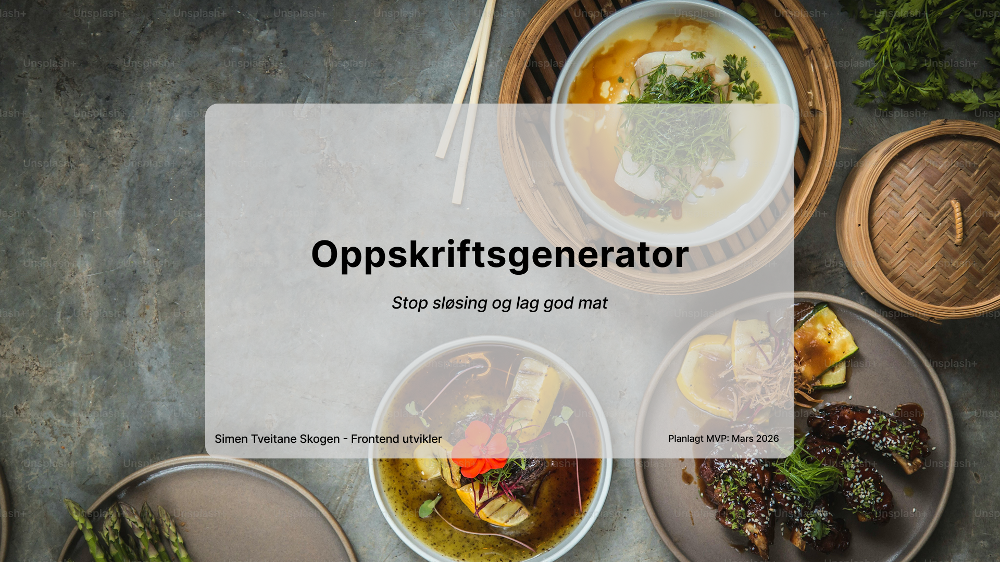

# Oppskriftsgenerator

## Om prosjektet

    Jeg ville lage et prosjekt om en av interessene mine som er å lage mat. Begynte å gjøre research på hva slags applikasjoner jeg kunne lage om interessen, men kom på mens jeg gjorde undersøkelse at jeg må jo ha noe som faktisk løser et problem.

    Jeg begynte å tenke på problemer som jeg ofte har hatt som andre også tenker sikkert på. Dette fikk meg til å ende med et spørsmål til meg selv Hvor mange ganger har jeg stått foran et fullt kjøleskap og tenkt: «Hva i alle dager skal jeg lage nå?» eller oppdaget at noe har blitt glemt bakerst og blitt dårlig?

    Startet med å vurdere om dette er et hverdagsproblem som kan bli løst ved hjelp av frontend utvikling og UX design. Til slutt ble jeg enig om oppskriftsgenerator applikasjon der vi kan søke etter ingredienser, finne oppskrifter basert på ingredienser du har i kjøleskapet.

## Problemer & smertpunkter

## Målgruppe

## Research & Personas

## User Flows & Scenarios

## Sitemap / Informasjonsarkitektur

## Low-Fi Wireframes (mobil-først)

## MVP – Minimum Viable Product

## Tech Stack (planlagt)

| Kategori    | Teknologi / Verktøy  | Begrunnelse                          |
| ----------- | -------------------- | ------------------------------------ |
| Frontend    | Next.js + TypeScript | Moderne, SEO-vennlig, app router     |
| Styling     | Tailwind CSS         | Rask prototyping, mobil-først        |
| Komponenter | Shadcn UI            | Ferdige komponenter, lett gjennbruk  |
| API         | Spoonacular          | Gratis ingrediens-basert oppskrifter |
| Deployment  | Vercel               | Enkel, automatisk PWA-støtte         |
